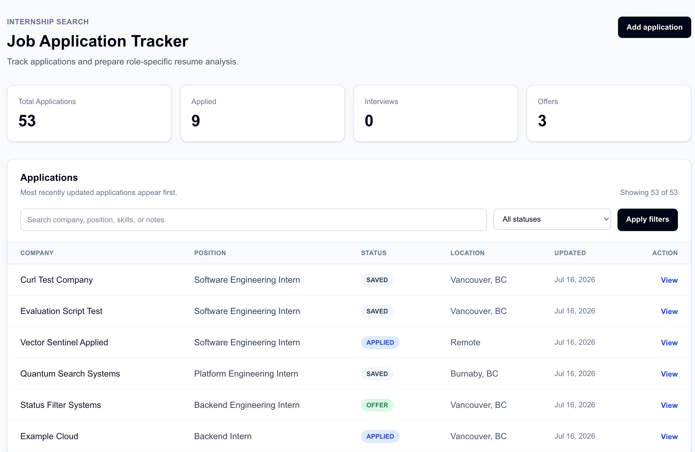
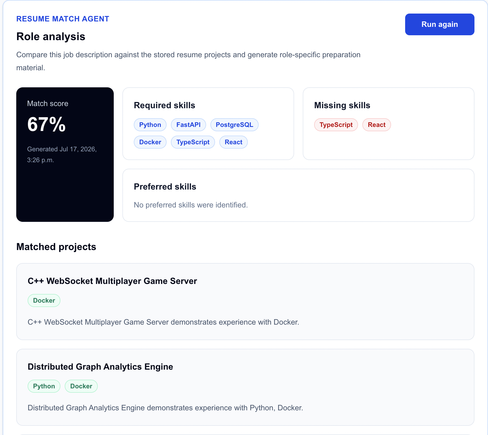
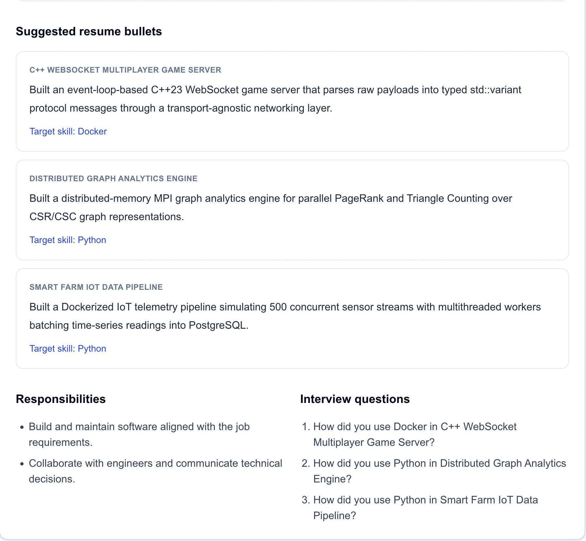

# AI Job Application Tracker & Resume Match Agent

A deployed full-stack internship application tracker that stores job
applications, analyzes job descriptions against resume projects, and generates
structured resume-match results.

The project combines a Next.js frontend, FastAPI backend, PostgreSQL database,
provider-based analysis architecture, OpenAI-ready structured output support,
Docker Compose development, and GitHub Actions CI.

## Live Demo

- [Application Tracker](https://ai-job-application-tracker-alpha.vercel.app)
- [FastAPI Documentation](https://ai-job-application-agent-api.vercel.app/docs)
- [Backend Health Check](https://ai-job-application-agent-api.vercel.app/health)

The public deployment uses the deterministic mock analysis provider and does not
make paid OpenAI API requests.

> [!WARNING]
> The public demo does not currently include authentication or per-user data
> isolation. All application records are shared. Do not enter personal,
> confidential, or real job-application information.

## Production Deployment

| Component | Platform |
| :--- | :--- |
| Frontend | Vercel, Next.js |
| Backend | Vercel Python Functions, FastAPI |
| Database | Neon PostgreSQL |
| Analysis provider | Deterministic mock provider |

Production traffic flows from the Vercel-hosted Next.js frontend to the
Vercel-hosted FastAPI API, which persists applications and analyses in Neon
PostgreSQL.

## Screenshots

### Application Dashboard



### Resume Match Analysis




## Project Highlights

- Full-stack application dashboard built with Next.js, React, TypeScript, and Tailwind CSS
- FastAPI backend with PostgreSQL persistence, SQLAlchemy models, and Alembic migrations
- Application CRUD workflow with search, status filtering, detail pages, editing, and deletion
- Provider-based analysis architecture with deterministic mock and OpenAI-backed providers
- Structured analysis output validated with Pydantic
- Saved analysis history with latest-analysis retrieval
- Provider-independent evaluation helpers for checking generated analysis quality
- Docker Compose local development environment
- GitHub Actions CI for backend tests, frontend lint/build, and Playwright smoke tests

## Current Features

### Job Application Tracking

- Create, view, edit, and delete job applications
- Track application status:
  - `SAVED`
  - `APPLIED`
  - `INTERVIEW`
  - `OFFER`
  - `REJECTED`
- Store job descriptions, locations, posting URLs, and personal notes
- Search applications by:
  - company
  - position
  - location
  - job description
  - notes
- Filter applications by status
- Combine keyword search and status filtering
- Preserve dashboard filters in the URL

### Frontend Experience

- Responsive application dashboard
- Application detail pages
- Create and edit forms
- Two-step deletion confirmation
- Route-level loading skeletons
- Route-level error boundaries
- Retry failed server-side requests
- Separate missing-resource pages from temporary backend failures

### Resume Match Analysis

- Load an application's job description from PostgreSQL
- Compare the role against stored resume projects
- Extract known technical requirements
- Identify matched and missing skills
- Match relevant projects to job requirements
- Generate resume bullet suggestions
- Generate project-focused interview questions
- Calculate a match score from 0 to 100
- Validate structured analysis output with Pydantic
- Persist each generated analysis in PostgreSQL
- Run or re-run analysis from an application detail page
- Display the latest saved analysis in the frontend
- Show match scores, skill gaps, matched projects, resume suggestions, and interview questions

The current implementation uses a deterministic mock provider. It does not
require API credentials or make external AI requests.

---

## Architecture

```text
Next.js Frontend
       |
       | HTTP
       v
FastAPI Application
       |
       +--> Application CRUD
       |
       +--> AnalysisService
                 |
                 +--> AnalysisProvider interface
                 |        |
                 |        +--> MockAnalysisProvider
                 |        +--> OpenAIAnalysisProvider
                 |
                 +--> PostgreSQL
```

The analysis workflow is separated into three layers:

1. **API layer**  
   Receives requests and converts domain errors into HTTP responses.

2. **Service layer**  
   Loads applications and resume projects, invokes the configured provider,
   and persists validated results.

3. **Provider layer**  
   Generates an `AnalysisResult` without depending on FastAPI, SQLAlchemy, or
   a specific AI vendor.

This design allows the deterministic mock provider to be replaced by an
OpenAI-backed provider without changing the API response schema.

---

## OpenAI Provider

The backend includes an `OpenAIAnalysisProvider` that uses the OpenAI Python SDK
and structured output parsing.

The provider is implemented, but the default runtime provider remains the
deterministic mock provider so the application can run locally, in tests, and in
CI without external credentials.

Provider selection is controlled through environment variables:

```
ANALYSIS_PROVIDER=mock
```

or

```
ANALYSIS_PROVIDER=openai
OPENAI_MODEL=gpt-5.5
OPENAI_API_KEY=your_secret_key
```

The OpenAI provider is intentionally kept behind configuration so API keys are
never required for normal development or automated tests.

## Provider Configuration

The analysis provider is selected through environment variables.

| Variable | Default | Description |
| :--- | :--- | :--- |
| `ANALYSIS_PROVIDER` | `mock` | Selects `mock` or `openai` |
| `OPENAI_MODEL` | `gpt-5.5` | Model name passed to the OpenAI provider |
| `OPENAI_API_KEY` | empty | API key used only when `ANALYSIS_PROVIDER=openai` |

The default provider is `mock`, so the application works locally, in tests, and
in CI without API credentials. Selecting `openai` requires a server-side
`OPENAI_API_KEY`.

To test provider selection without making an API call:

```bash
ANALYSIS_PROVIDER=openai \
OPENAI_MODEL=test-model \
OPENAI_API_KEY=test-key \
docker compose up --build
```

For a real manual OpenAI provider test, follow:

```text
docs/openai-smoke-test.md
```

Do not commit real API keys. Keep secrets in local environment variables only.

## Deployment Notes

Production-style deployment guidance is documented in:

```text
docs/deployment-notes.md
```

The repository also includes:

```text
.env.production.example
```

for documenting production environment variable names without committing real
secrets.

## Provider Failure Handling

Analysis provider failures are converted into stable API responses.

When the active provider cannot complete an analysis request, the backend
returns:

```json
{
  "detail": "Analysis provider unavailable"
}
```

with HTTP status 503 Service Unavailable.

This keeps provider-specific failures separate from application-level errors
such as missing applications or missing saved analyses.

## Analysis Evaluation

The backend includes lightweight evaluation helpers for checking generated
analysis quality.

The evaluator checks whether:

- matched projects exist in the stored resume project list
- matched skills are supported by project tech stacks or project descriptions
- covered skills are not incorrectly marked as missing
- suggested bullets reference real projects
- matched analyses include interview questions
- unusually short or weak suggestions are surfaced as warnings

This evaluation layer is provider-independent, so it can be used with both the
deterministic mock provider and the OpenAI-backed provider.

To evaluate the latest saved analysis for an application:

```bash
docker compose exec backend python -m app.scripts.evaluate_latest_analysis APPLICATION_ID
```

The command exits with:

- 0 when the analysis passes evaluation
- 1 when evaluation issues are found
- 2 when the application ID is invalid, missing, or has no saved analysis

## Structured Analysis Output

Each analysis contains:

- required skills
- preferred skills
- role responsibilities
- matched resume projects
- missing skills
- tailored resume bullet suggestions
- interview questions
- a match score from 0 to 100


<details>
<summary>Example structured analysis response</summary>

```json
{
  "required_skills": ["Python", "FastAPI", "React"],
  "preferred_skills": [],
  "responsibilities": [
    "Build and maintain software aligned with the job requirements."
  ],
  "matched_projects": [
    {
      "project_name": "Smart Farm IoT Data Pipeline",
      "matched_skills": ["Python", "FastAPI"],
      "reason": "The project demonstrates relevant backend experience."
    }
  ],
  "missing_skills": ["React"],
  "suggested_bullets": [
    {
      "project_name": "Smart Farm IoT Data Pipeline",
      "bullet": "Built a containerized telemetry pipeline using FastAPI.",
      "target_skill": "FastAPI"
    }
  ],
  "interview_questions": [
    "How did you use FastAPI in Smart Farm IoT Data Pipeline?"
  ],
  "match_score": 67,
  "id": "analysis-uuid",
  "application_id": "application-uuid",
  "created_at": "2026-01-01T00:00:00Z"
}
```
</details> ```

---

## Tech Stack

| Layer | Technology |
| :--- | :--- |
| Frontend | Next.js, React, TypeScript, Tailwind CSS |
| Backend | Python, FastAPI, Pydantic |
| Database | PostgreSQL, SQLAlchemy, Alembic |
| Analysis | Provider interface, deterministic mock provider, OpenAI SDK provider, structured outputs |
| Testing | Pytest, FastAPI TestClient, Playwright |
| Infrastructure | Docker, Docker Compose, GitHub Actions |

---

## Local Development

### Requirements

- Docker
- Docker Compose

### Start the application

```bash
docker compose up --build
```

Services:

| Service | URL |
| :--- | :--- |
| Frontend | `http://localhost:3000` |
| Backend API | `http://localhost:8000` |
| FastAPI documentation | `http://localhost:8000/docs` |
| Backend health check | `http://localhost:8000/health` |

### Apply database migrations

```bash
docker compose exec backend alembic upgrade head
```

### Seed resume projects

```bash
docker compose exec backend python -m app.scripts.seed_resume_projects
```

The seed command inserts or updates:

- Smart Farm IoT Data Pipeline
- Distributed Graph Analytics Engine
- C++ WebSocket Multiplayer Game Server

---

## API Endpoints

### Health

```text
GET /health
GET /health/db
```

### Resume Projects

```text
GET /resume-projects
```

### Applications

```text
POST /applications/{application_id}/analyze
GET  /applications/{application_id}/analysis
GET    /applications/{application_id}
PATCH  /applications/{application_id}
DELETE /applications/{application_id}
```

### Analysis

```text
POST /applications/{application_id}/analyze
```

Each analysis request currently creates a new record in PostgreSQL.

Example:

```bash
curl -X POST \
  http://localhost:8000/applications/{application_id}/analyze
```

Retrieve the most recently created analysis:

```bash
curl \
  http://localhost:8000/applications/{application_id}/analysis
```

The endpoint returns 404 Analysis not found when the application exists but
has not been analyzed.

### Application Query Parameters

`GET /applications` supports:

| Parameter | Description |
| :--- | :--- |
| `q` | Case-insensitive search across application text fields |
| `status` | Filter by application status |

Examples:

```text
GET /applications?q=python
GET /applications?status=APPLIED
GET /applications?q=python&status=APPLIED
```

---

## Frontend Routes

| Route | Description |
| :--- | :--- |
| `/` | Application dashboard |
| `/?q={keyword}&status={status}` | Filtered dashboard |
| `/applications/new` | Create application form |
| `/applications/{id}` | Application detail page |
| `/applications/{id}/edit` | Edit application form |

The application detail page can generate a new analysis and display the latest
saved result, including skill gaps, matched projects, resume suggestions, and
interview questions.

---

## Testing

Apply migrations before running the test suite:

```bash
docker compose exec backend alembic upgrade head
```

Run all backend tests:

```bash
docker compose exec backend pytest
```

The test suite covers:

- application health and database connectivity
- resume project retrieval
- application creation and listing
- application detail retrieval
- partial application updates
- application deletion
- missing-resource handling
- invalid UUID and status validation
- keyword search
- status filtering
- combined search and filtering
- structured analysis schema validation
- analysis score validation
- deterministic mock provider behavior
- skill and project matching
- analysis service persistence
- provider failure handling
- application analysis API responses
- analysis records saved in PostgreSQL
- latest application analysis retrieval
- applications without saved analyses
- provider configuration validation
- provider failure HTTP handling
- analysis grounding evaluation
- unsupported matched skill detection
- missing skill consistency checks
- saved analysis evaluation script
- evaluation CLI formatting and exit behavior
- frontend dashboard smoke tests
- frontend application form smoke tests
- CI Playwright smoke test execution

Run frontend end-to-end smoke tests:

```bash
cd frontend
API_URL=http://127.0.0.1:8000 \
NEXT_PUBLIC_API_URL=http://127.0.0.1:8000 \
npm run test:e2e
```
The Playwright tests cover:

- dashboard rendering
- dashboard filter URL behavior
- new application form rendering
- browser-side required-field validation

### Continuous Integration

GitHub Actions runs the same Docker Compose checks on pushes to `master` and on
pull requests:

- build Docker images
- apply backend migrations
- run backend tests
- run frontend lint
- run frontend build
- install Playwright Chromium
- run frontend e2e smoke tests

Workflow file:

```text
.github/workflows/ci.yml
```

---

## Current Limitations

- The default runtime provider is the deterministic mock provider
- The OpenAI provider requires manual environment configuration
- Re-running analysis creates an additional database record
- End-to-end tests currently focus on stable frontend smoke coverage rather than the full analysis workflow
- The public deployment has no authentication or per-user data isolation
- Application records in the deployed demo are stored in a shared database

---

## Planned Development

1. Add stable end-to-end analysis workflow coverage
2. Add production deployment workflow examples
3. Add deployed demo screenshots or short walkthrough media